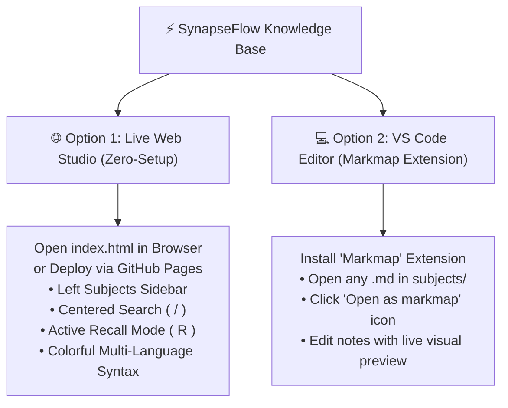

# 👨‍💻 SynapseFlow
### The Visual Knowledge Engine & Active Recall System for Software Engineers
*(Python • Java • Operating Systems • Computer Networking • SQL & Databases)*

**SynapseFlow** transforms dense computer science and technical interview fundamentals into organic, interactive visual mindmaps. Designed with modern dark-neon aesthetics, real-time query searching, active recall self-testing, and multi-line syntax cheatsheets.

---

## 🚀 How to Experience SynapseFlow

You can explore SynapseFlow through two seamless experiences:



### Option 1: 🌐 Instant Web Studio & GitHub Pages *(No Installation Needed)*
- **Local Use**: Simply double-click **[`index.html`](index.html)** to open it directly in Google Chrome, Edge, or Firefox.
- **GitHub Pages Deployment (Share with Anyone)**:
  1. Push this repository to GitHub.
  2. Navigate to **Repository Settings** &rarr; **Pages**.
  3. Under *Build and deployment*, set **Source** to `Deploy from a branch` and select `main` / `root`.
  4. Your studio will be live at:
     ```text
     https://<your-username>.github.io/<repository-name>/
     ```
  *(Because the entry file is `index.html`, GitHub Pages serves the studio automatically at the root address without needing any extra file extensions!)*

---

### Option 2: 💻 Inside VS Code *(Interactive Tree with Markmap Extension)*
If you prefer viewing or authoring markdown files directly in your IDE:
1. Open the VS Code Extensions view (`Ctrl + Shift + X`).
2. Search for **`Markmap`** (by *gerald*) and click **Install** (`gerald.markmap`).
3. Open any roadmap file in [`subjects/`](subjects/) (e.g. [`subjects/sql-prep.md`](subjects/sql-prep.md)).
4. Click the **Open as markmap** button in the top-right corner of the editor tab.
5. You can now fold/unfold branches, inspect tree hierarchy, and edit technical notes with a real-time reactive graph preview.

---

## 🛠️ Tech Stack & Engineering Architecture

| Layer | Technologies | Role in SynapseFlow |
| :--- | :--- | :--- |
| **Core Web Platform** | **Semantic HTML5** & **Vanilla JavaScript (ES6+)** | Zero-framework bloat. Delivers instant load times, 60fps graph rendering, and responsive DOM updates without React/Vue virtual DOM overhead. |
| **Styling & Design System** | **Vanilla CSS3** *(Glassmorphism, CSS Grid, Flexbox)* | Custom dark-neon design system (`Plus Jakarta Sans` & `JetBrains Mono` typography, CSS custom properties, `backdrop-filter: blur`, pulsing search animations, custom scrollbars). |
| **Data Visualization & Graphing** | **D3.js (v7)** + **Markmap Engine** | Dynamic SVG rendering, zoom/pan drag physics, hierarchical tree transformations, and collapsible node states. |
| **Custom Graph Mathematics** | **[`markmap-view.js`](markmap-view.js)** | Custom patch calculating vertical line center-points so branch curves connect symmetrically with circle pins and card borders. |
| **Parsing & Syntax Highlighting** | **Highlight.js (`hljs`)** + **Markdown-it** | Lexical tokenization of Python, Java, and SQL grammar; custom-themed CSS tokens for keywords, methods, types, and strings. |
| **Data Architecture** | **Embedded Markdown Containers** (`<script type="text/markdown">`) | **Offline-First / Zero-CORS design**. Stores subject curricula directly in the DOM so users can double-click `index.html` locally without browser CORS security blocks. |
| **Tooling & IDE Integration** | **VS Code Markmap Extension** + **GitHub Pages** | Two-tier distribution: zero-setup web hosting via GitHub Pages, plus local Markdown authoring with live visual tree previews. |

### 💡 Key Architectural Decisions
1. **Why Vanilla JS + D3 over React/Next.js?**
   Direct SVG manipulation via D3.js gives complete control over vector geometry and zoom/pan physics. Avoiding a heavy virtual DOM framework keeps the total bundle under 150KB and guarantees silky-smooth 60fps interaction.
2. **Zero-CORS Offline Data Design:**
   Modern browsers block local `fetch()` requests on `file:///` origins due to sandbox security policies. Embedding curricula inside `<script type="text/markdown">` data containers allows the entire studio to operate 100% offline with zero dependencies, zero build steps, and zero CORS errors.
3. **Cognitive UX & Active Recall Engine:**
   Programmatic node traversal collapses leaf answer nodes to Level 2 upon pressing `R`, empowering candidates to mentally self-test before revealing explanations.

---

## 📂 Directory Structure

```text
SynapseFlow/
├── subjects/                     # 📚 Core curriculum & visual roadmap sheets
│   ├── java-prep.md              # Java internals, JVM memory, Concurrency & Collections
│   ├── python-prep.md            # Python data model, GIL, OOP, Generators & Memory
│   ├── os-prep.md                # Operating Systems, CPU scheduling, Virtual Memory & IPC
│   ├── networking-prep.md        # Computer Networks, OSI layers, TCP/UDP & Protocols
│   └── sql-prep.md               # SQL, DDL/DML, Execution Order, Joins & PL/SQL
├── index.html                    # 🎨 SynapseFlow Standalone Web Studio
├── markmap-view.js               # ⚡ Engine with centered branch links & node alignment
└── README.md                     # 📖 Project documentation & study guide
```

---

## 🗂️ Subject Curriculums (`subjects/`)

| File | Subject | Core Topics & Syntax Cheatsheets |
| :--- | :--- | :--- |
| **[`subjects/python-prep.md`](subjects/python-prep.md)** | **Python** | `==` vs `is`, Method types (`self`/`cls`/static), `__new__` vs `__init__`, Generators, Decorators, GIL, Concurrency (`threading` vs `multiprocessing` vs `asyncio`) |
| **[`subjects/java-prep.md`](subjects/java-prep.md)** | **Java & JVM** | `==` vs `.equals()`, Abstract Class vs Interface, Overload vs Override (`vtable`), JVM Memory (Heap/Stack/Metaspace), GC algorithms, Concurrency (`ReentrantLock`, `volatile`) |
| **[`subjects/os-prep.md`](subjects/os-prep.md)** | **Operating Systems** | Process vs Thread, CPU Scheduling (CFS, Round Robin), Virtual Memory, TLB, Page Faults, Deadlocks (Coffman conditions), Mutex vs Semaphore |
| **[`subjects/networking-prep.md`](subjects/networking-prep.md)** | **Computer Networks** | OSI 7 Layers, Famous Protocols (DNS, DHCP, ARP, TCP 3-Way Handshake, UDP, HTTP/1.1 vs HTTP/2 vs HTTP/3, WebSockets, TLS 1.3), CIDR Subnetting |
| **[`subjects/sql-prep.md`](subjects/sql-prep.md)** | **SQL & Databases** | DDL vs DML (`TRUNCATE` vs `DELETE`), Query Execution Order, All Joins & Anti-Joins, Normalization (1NF-BCNF, OLTP vs OLAP), PL/SQL (Procedures, Triggers, Cursors), B+ Trees, ACID |

---

## 🎨 Web Studio Features (`index.html`)

- 🧭 **Collapsible Subject Sidebar**: Fast one-click switching across all 5 technical domains (`Ctrl + B`).
- 🔍 **Centered Search Engine**: Instant multi-keyword search highlighting with smooth visual scrolling (`/` shortcut).
- 🌈 **Multi-Language Syntax Highlighting**: Custom dark-neon Highlight.js theme across Python, Java, and SQL:
  - **Keywords** (`class`, `def`, `SELECT`, `FROM`, `WHERE`): Radiant Neon Purple (`#c084fc`)
  - **Functions & Methods** (`__init__`, `__new__`, `println`): Electric Cyan (`#38bdf8`)
  - **Classes & Types** (`Singleton`, `String`, `INT`, `DECIMAL`): Warm Golden Amber (`#facc15`)
  - **Strings** (`"text"`, `'inactive'`): Mint Emerald Green (`#4ade80`)
  - **Numbers** (`500`, `1_000_000`): Bright Tangerine Orange (`#fb923c`)
  - **Comments** (`# ...`, `// ...`, `-- ...`): Slate Gray italic (`#64748b`)
  - **Literals & Built-ins** (`None`, `null`, `true`, `super`): Rose Coral (`#f43f5e`)
  - **Decorators / Annotations** (`@classmethod`, `@Override`): Soft Lavender Violet (`#a78bfa`)
- 📐 **Symmetrical Geometric Layout**: Connects branch lines directly to the vertical center of circles and card boundaries.
- ⚡ **Active Recall Mode (`R`)**: Auto-collapses nodes to Level 2 for self-testing before revealing answers.
- 🎚️ **Depth Selector**: Quick toggle pills (`L1`, `L2`, `L3`, `All`) to instantly expand or fold sub-trees.

---

## ⌨️ Studio Keyboard Shortcuts

| Shortcut | Description |
| :---: | :--- |
| `1` | Switch to **Java** |
| `2` | Switch to **Python** |
| `3` | Switch to **Operating Systems** |
| `4` | Switch to **Computer Networks** |
| `5` | Switch to **SQL & Databases** |
| `/` | Focus the **Search Bar** |
| `R` | Toggle **Active Recall Mode** |
| `F` | **Fit Mindmap** to Screen |
| `Ctrl + B` | Toggle **Subject Sidebar** |
| `Esc` | Blur Search Bar |

---

## 🧠 The 3-Step Active Recall Methodology

1. **Step 1 — Macro Scaffold**: Select `L1` or `L2` to absorb the top-level architecture of the domain.
2. **Step 2 — Prompt & Self-Test**: Press `R` to engage Active Recall. Read the topic header (e.g., *`__new__` vs `__init__`* or *`TRUNCATE` vs `DELETE`*), mentally explain the mechanics, and then expand the node to verify.
3. **Step 3 — Cross-Domain Neural Linking**: Connect concepts across disciplines:
   - OS Virtual Memory $\longleftrightarrow$ JVM Heap/Metaspace $\longleftrightarrow$ DB Buffer Pool
   - OS Kernel Threads $\longleftrightarrow$ Java Virtual Threads $\longleftrightarrow$ Python GIL
   - OS Mutex/Semaphores $\longleftrightarrow$ Java `synchronized` $\longleftrightarrow$ SQL Row-Level Locks
   - Network Sockets $\longleftrightarrow$ OS IPC $\longleftrightarrow$ Python Asyncio Event Loop
