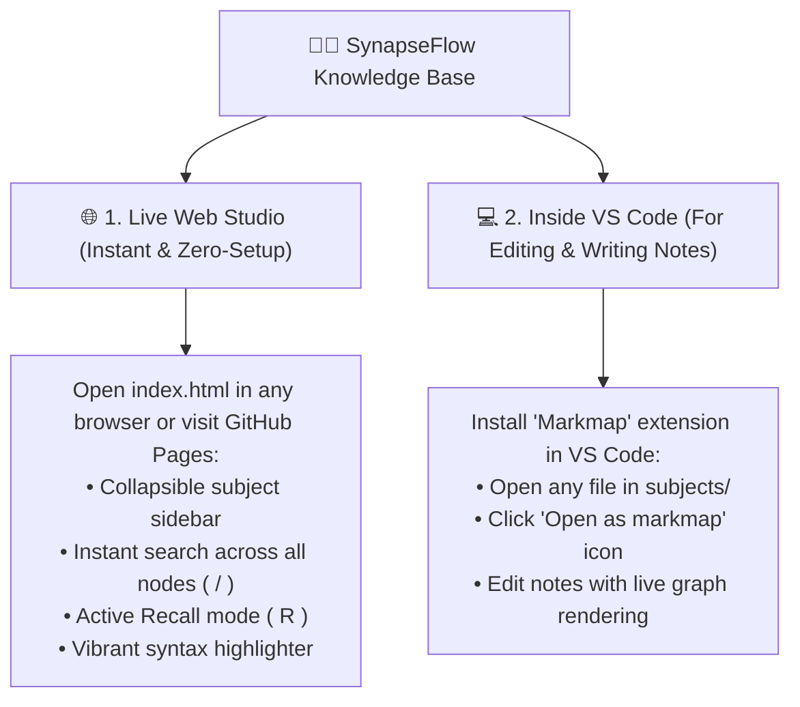

# 👨‍💻 SynapseFlow
### The Visual Knowledge Engine & Active Recall System for Software Engineers
*(Python • Java • Operating Systems • Computer Networking • SQL & Databases)*

[](https://kaushikbarnwal.github.io/SynapseFlow/)
[](index.html)
[](LICENSE)

**SynapseFlow** is my personal interactive visual knowledge engine designed to master computer science fundamentals and ace technical interviews. 

Instead of flipping through 50-page PDFs or flat Notion checklists, I built SynapseFlow to turn dense engineering concepts into organic, expandable mindmaps with instant active-recall testing, multi-line syntax cheatsheets, and a dark-neon terminal aesthetic.

👉 **Try it live here:** [https://kaushikbarnwal.github.io/SynapseFlow/](https://kaushikbarnwal.github.io/SynapseFlow/)

---

## 💡 Why I Built This

When prepping for tech interviews across multiple domains (Python, Java, OS, Networks, Databases), I ran into three big frustrations:

1. **Information Overload**: Traditional docs are linear and flat. You lose sight of the big picture and forget how low-level OS memory maps to the JVM Heap or DB Buffer Pools.
2. **Passive Reading vs. Active Recall**: Staring at solved answers tricks your brain into thinking you know it. I needed a tool that hides the answers by default and forces me to explain the mechanics before expanding.
3. **Setup Friction**: I wanted an app that anyone (including interviewers or peers) can open with a single click—no `npm install`, no Docker containers, no CORS configuration, and 100% offline-ready.

So I engineered SynapseFlow.

---

## 🚀 How to Use SynapseFlow

I designed the project with two distinct workflows:



### 1. 🌐 The Web Studio *(Best for Studying & Sharing)*
- **Live on GitHub Pages**: [https://kaushikbarnwal.github.io/SynapseFlow/](https://kaushikbarnwal.github.io/SynapseFlow/)
- **Run Locally**: Clone the repo and double-click **[`index.html`](index.html)** in any browser. It runs completely standalone with zero build steps or server setup.

### 2. 💻 Inside VS Code *(Best for Taking Notes)*
If you want to read or expand on my markdown roadmaps directly in your editor:
1. Install the **`Markmap`** extension in VS Code (`gerald.markmap`).
2. Open any subject file in [`subjects/`](subjects/) (e.g. [`subjects/sql-prep.md`](subjects/sql-prep.md)).
3. Click the **Open as markmap** button in the top-right corner of the tab.
4. You get an interactive visual tree right next to your code editor!

---

## 🛠️ My Tech Stack & Architectural Decisions

I intentionally kept the stack lightweight, robust, and dependency-free:

| Layer | Technology | Why I Chose It |
| :--- | :--- | :--- |
| **Core Web App** | **Vanilla JavaScript (ES6+) & HTML5** | I deliberately avoided React/Next.js. Since the mindmap requires direct SVG canvas manipulation via D3.js, skipping a virtual DOM keeps the bundle under 150KB and delivers native 60fps pan/zoom performance. |
| **Design System** | **Vanilla CSS3** | Custom dark-mode glassmorphism (`Plus Jakarta Sans`, `JetBrains Mono`, CSS variables, smooth cubic-bezier transitions, and glowing neon accents). |
| **Mindmap Engine** | **D3.js (v7) + Markmap** | Powers the dynamic vector layout, zoom/pan drag physics, and node expansion states. |
| **Custom Graph Math** | **[`markmap-view.js`](markmap-view.js)** | I patched the line-routing calculations so the branch curves connect symmetrically to the exact vertical center of node circles, preventing text uplift. |
| **Syntax Highlighting** | **Highlight.js (`hljs`)** | Custom neon palette for Python, Java, and SQL keywords, classes, functions, strings, and trap snippets. |
| **Data Architecture** | **Embedded `<script type="text/markdown">`** | **Zero-CORS Offline Design**: Browsers block local `fetch()` calls on `file:///` URLs due to sandbox security. By embedding the curricula directly into DOM data containers, the app works 100% offline anywhere without CORS errors. |

---

## 📂 Project Structure

```text
SynapseFlow/
├── subjects/                     # 📚 My markdown curricula & interview cheat sheets
│   ├── java-prep.md              # Java internals, JVM memory, Concurrency & Collections
│   ├── python-prep.md            # Python data model, GIL, OOP, Generators & Memory
│   ├── os-prep.md                # Operating Systems, CPU scheduling, Virtual Memory & Locks
│   ├── networking-prep.md        # Computer Networks, OSI layers, TCP/UDP & Protocols
│   ├── sql-prep.md               # SQL, DDL/DML, Execution Order, Joins & PL/SQL
│   └── dsa-prep.md               # Data Structures Theory (Basics, Moderate & Advanced)
├── index.html                    # 🎨 Standalone Web Studio (Double-click & run!)
├── markmap-view.js               # ⚡ Engine with my centered link-curve alignment patch
└── README.md                     # 📖 Project documentation & study guide
```

---

## 🗂️ What's Covered in the Curricula (`subjects/`)

| Subject | Source File | Core Topics & Syntax Traps Covered |
| :--- | :--- | :--- |
| **Python** | **[`subjects/python-prep.md`](subjects/python-prep.md)** | `==` vs `is`, Method types (`self`/`cls`/static), `__new__` vs `__init__`, Generators, Decorators, GIL, Concurrency models (`threading` vs `multiprocessing` vs `asyncio`), mutable default argument trap. |
| **Java & JVM** | **[`subjects/java-prep.md`](subjects/java-prep.md)** | `==` vs `.equals()`, Abstract Class vs Interface, Overload vs Override (`vtable`), JVM Memory (Heap/Stack/Metaspace), Garbage Collectors (G1/ZGC), Concurrency (`ReentrantLock`, `volatile`). |
| **Operating Systems** | **[`subjects/os-prep.md`](subjects/os-prep.md)** | Process vs Thread memory, CPU Scheduling (CFS, Round Robin), Virtual Memory, TLB, Page Fault mechanics, Deadlocks (Coffman conditions), Mutex vs Semaphore. |
| **Computer Networks** | **[`subjects/networking-prep.md`](subjects/networking-prep.md)** | OSI 7 Layers, Key Protocols (DNS, DHCP, ARP, TCP 3-Way Handshake, UDP, HTTP/1.1 vs HTTP/2 vs HTTP/3, WebSockets, TLS 1.3), CIDR Subnetting math. |
| **SQL & Databases** | **[`subjects/sql-prep.md`](subjects/sql-prep.md)** | DDL vs DML (`TRUNCATE` vs `DELETE`), Query Execution Order, All Joins & Anti-Joins, Normalization (1NF-BCNF, OLTP vs OLAP), PL/SQL (Procedures, Triggers, Cursors), B+ Trees, ACID & Isolation. |
| **Data Structures (Theory)** | **[`subjects/dsa-prep.md`](subjects/dsa-prep.md)** | Complexity Asymptotics, Cache Locality, Dynamic Arrays, Circular Deque, HashMap collisions & treeification, BST deletions, Heaps Floyd construction, Self-balancing (AVL & Red-Black), DSU, Tries, B/B+ Trees, LRU/LFU cache, Bloom Filters. |

---

## ⌨️ Studio Shortcuts (Built for Speed)

When studying in the web studio, navigate topics with quick hotkeys and modal chords:

| Key | Action |
| :---: | :--- |
| `1` $\rightarrow$ `A` / `B` | **Languages & Runtimes**: `1` then `A` for Java, `1` then `B` for Python |
| `2` $\rightarrow$ `A` / `B` / `C` | **CS Core Systems**: `2` then `A` for OS, `2` then `B` for Networks, `2` then `C` for SQL |
| `3` $\rightarrow$ `A` / `B` / `C` | **Data Structures & Algo**: `3` then `A` for DS Theory, `B` for Code *(Soon)*, `C` for Algo *(Soon)* |
| `/` | Jump straight to the **Search Bar** |
| `R` | Toggle **Active Recall Mode** (collapses leaf answers for self-testing) |
| `F` | **Fit & Center** the mindmap to the screen |
| `Ctrl + B` | Toggle the **Subject Sidebar** |
| `Esc` | Disarm chord navigation or exit search |

---

## 🧠 My 3-Step Active Recall Study Routine

Here is the exact method I use to study and retain these concepts:

1. **Step 1 — The Macro Scaffold**: I start at depth `L1` or `L2` to absorb the bird's-eye view of how the domain is structured.
2. **Step 2 — Prompt & Self-Test**: I press `R` to turn on Active Recall. I look at a topic title (like *“`__new__` vs `__init__`”* or *“`TRUNCATE` vs `DELETE`”*), explain the internal mechanics out loud in 60 seconds, and then click the node to verify my answer.
3. **Step 3 — Cross-Domain Neural Linking**: I connect the dots across different subjects:
   - OS Virtual Memory $\longleftrightarrow$ JVM Heap/Metaspace $\longleftrightarrow$ DB Buffer Pool
   - OS Kernel Threads $\longleftrightarrow$ Java Virtual Threads $\longleftrightarrow$ Python GIL
   - OS Mutex/Semaphores $\longleftrightarrow$ Java `synchronized` $\longleftrightarrow$ SQL Row-Level Locks
   - Network Sockets $\longleftrightarrow$ OS IPC $\longleftrightarrow$ Python Asyncio Event Loop

---

## 👤 Author

**Kaushik Barnwal**  
- 🌐 Live Project: [https://kaushikbarnwal.github.io/SynapseFlow/](https://kaushikbarnwal.github.io/SynapseFlow/)
- ⭐ If you find this project helpful for your own interview preparation, feel free to star the repo!
